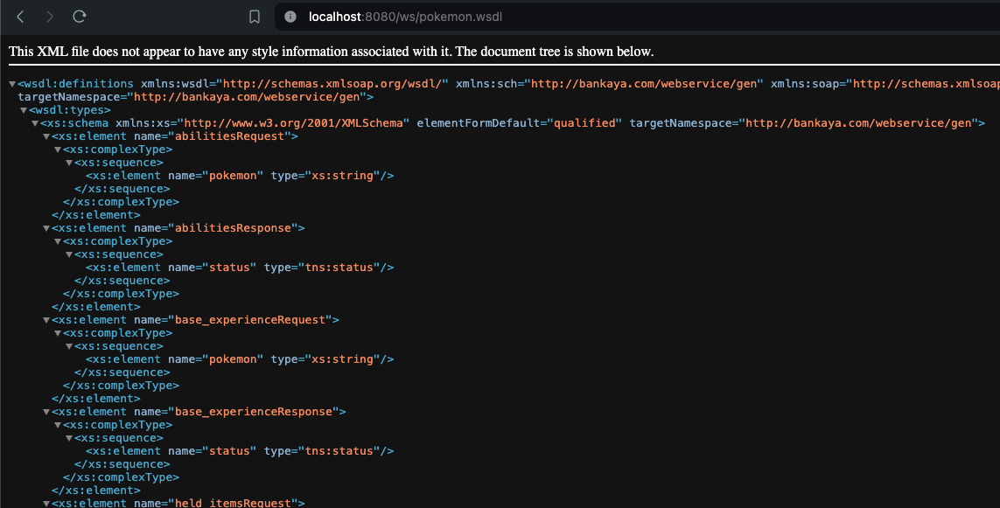
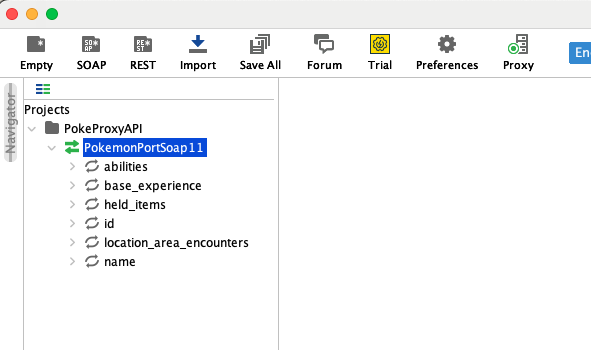
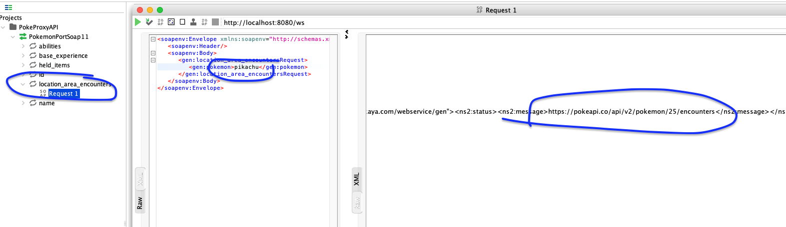
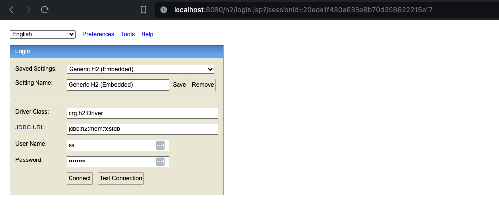
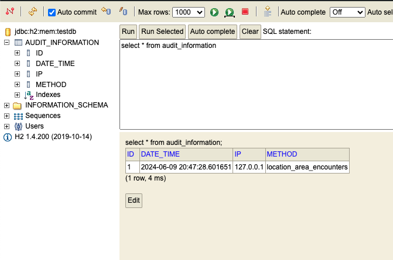

# Pokemon API

## Ejecución en ambiente local

### Requerimientos técnicos

- Maven 3+
- JDK 8
- SoapUI (_Utilizado para ejecutar peticiones de prueba_)

### Pruebas en ambiente local

Ejecutar el siguiente comando para iniciar la aplicación
```shell
$ mvn spring-boot:run
```

Para visualizar el wsdl generado visitar la url: http://localhost:8080/ws/pokemon.wsdl



### Realizar pruebas mediante el uso del programa SoapUI 

Métodos disponibles:

|Endpoint| Propósito                                                    |
|----------|--------------------------------------------------------------|
|abilities| Obtener todas las habilidades del pokemon especificado       |
|held_items| Obtener los pokemones que pertenecen al pokemon especificado |
|id| Obtener el id del pokemon especificado                       |
|location_area_encounters| Obtener la ubicación de los encuentros                       |
|name| Obtener el nombre del pokemon                                |
|base_experience| Obtener la experiencia del pokemon                           |



### Ejemplo de ejecución



### Información almacenada en la base de datos

Ingresar por medio del navegador a la url: http://localhost:8080/h2



Ingresar los mismos datos contenidos en la imagen, en Password colocar **password**, una vez dentro ejecutar la siguiente consulta SQL:

`select * from audit_information`

Y se obtendrá la información de los request realizados



_**NOTA:** La base de datos de H2 se configuro para almacenar la información en memoria, lo cual implica que la información que sea generada será eliminada una vez que la aplicación sea detenida._